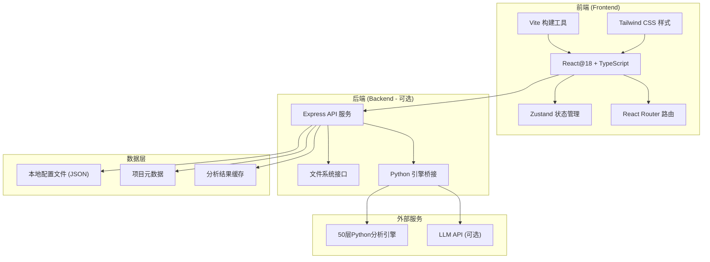
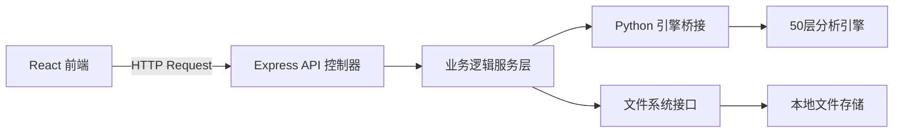
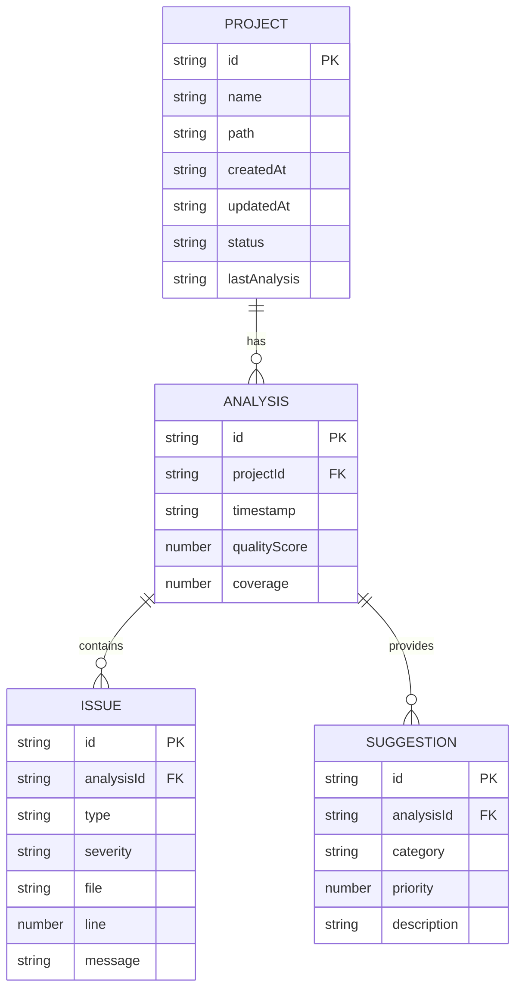

# 50层代码分析系统 - 新篇章 Web界面
## 技术架构文档

## 1. 架构设计



## 2. 技术描述
- **前端**: React@18 + TypeScript + TailwindCSS@3 + Vite
- **初始化工具**: vite-init
- **后端**: 可选 Express@4 (用于与 Python 引擎桥接)
- **数据库**: 本地 JSON 文件 + 文件系统存储
- **状态管理**: Zustand
- **路由**: React Router DOM
- **图标**: lucide-react

## 3. 路由定义
| 路由路径 | 用途 |
|----------|------|
| / | 首页 - 系统概览 |
| /projects | 项目管理页面 |
| /projects/:id | 项目详情页面 |
| /analysis | 代码分析页面 |
| /testing | 测试生成页面 |
| /settings | 系统设置页面 |
| /about | 关于页面 |

## 4. API定义（如果有后端）

```typescript
// 项目相关 API
interface Project {
  id: string;
  name: string;
  path: string;
  createdAt: string;
  updatedAt: string;
  lastAnalysis: string | null;
  status: 'idle' | 'analyzing' | 'completed' | 'error';
}

// 分析结果 API
interface AnalysisResult {
  projectId: string;
  timestamp: string;
  qualityScore: number;
  issues: Issue[];
  coverage: number;
  suggestions: Suggestion[];
}

interface Issue {
  id: string;
  type: string;
  severity: 'low' | 'medium' | 'high' | 'critical';
  file: string;
  line: number;
  message: string;
}

interface Suggestion {
  id: string;
  category: string;
  priority: number;
  description: string;
  estimatedBenefit: string;
}

// API 响应格式
interface ApiResponse<T> {
  success: boolean;
  data: T;
  message?: string;
}
```

## 5. 服务器架构图（如果有后端）



## 6. 数据模型

### 6.1 数据模型定义



### 6.2 数据存储定义

项目使用本地文件系统和 JSON 存储：

```json
// config.json
{
  "version": "3.0.0",
  "settings": {
    "theme": "dark",
    "llmConfig": {},
    "analysisRules": {}
  }
}

// projects.json
{
  "projects": [
    {
      "id": "uuid",
      "name": "My Project",
      "path": "/path/to/project",
      "createdAt": "2026-01-01T00:00:00.000Z",
      "updatedAt": "2026-01-01T00:00:00.000Z",
      "lastAnalysis": null,
      "status": "idle"
    }
  ]
}
```

## 7. 项目结构

```
/web-app
├── src/
│   ├── components/       # 可复用组件
│   │   ├── Header.tsx
│   │   ├── Sidebar.tsx
│   │   ├── ProjectCard.tsx
│   │   ├── QualityChart.tsx
│   │   └── AnalysisReport.tsx
│   ├── pages/            # 页面组件
│   │   ├── Home.tsx
│   │   ├── Projects.tsx
│   │   ├── ProjectDetail.tsx
│   │   ├── Analysis.tsx
│   │   ├── Testing.tsx
│   │   ├── Settings.tsx
│   │   └── About.tsx
│   ├── hooks/            # 自定义 hooks
│   │   ├── useProjects.ts
│   │   └── useAnalysis.ts
│   ├── utils/            # 工具函数
│   │   └── api.ts
│   ├── store/            # Zustand 状态管理
│   │   └── index.ts
│   ├── types/            # TypeScript 类型定义
│   │   └── index.ts
│   ├── App.tsx
│   └── main.tsx
├── api/                  # 后端 API (可选)
│   └── server.ts
├── package.json
├── vite.config.ts
├── tailwind.config.js
└── tsconfig.json
```

## 8. 技术栈选择理由

| 技术 | 理由 |
|------|------|
| React 18 | 成熟、生态丰富、组件化开发 |
| TypeScript | 类型安全、更好的开发体验和维护性 |
| Vite | 极速构建、热更新、开发体验优秀 |
| Tailwind CSS | 实用优先的 CSS 框架，快速实现美观界面 |
| Zustand | 轻量级状态管理，简单易用 |
| React Router | 标准的路由解决方案 |
| lucide-react | 现代、美观的图标库 |

