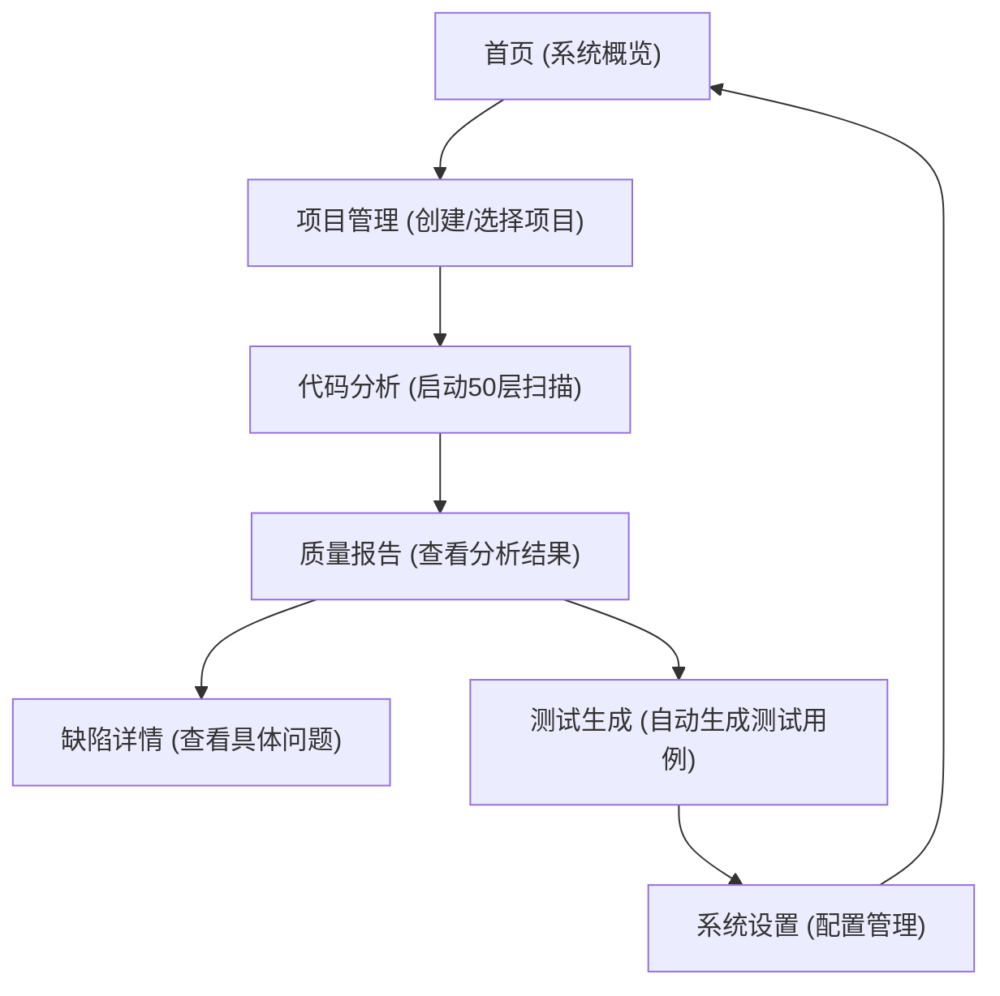

# 50层代码分析系统 - 新篇章 Web界面
## 产品需求文档 (PRD)

## 1. 产品概述

新一代企业级代码分析平台，提供深度代码智能分析、质量评估、测试生成等功能。通过现代化Web界面，让开发者可以直观地管理和使用50层微内核分析系统。

- 核心功能：代码扫描、质量评估、测试生成、AI智能分析、项目管理
- 目标用户：开发者、测试工程师、技术负责人
- 市场价值：提升代码质量、加速测试流程、降低维护成本

## 2. 核心功能

### 2.1 用户角色（如果适用）
| 角色 | 注册方式 | 核心权限 |
|------|----------|----------|
| 普通用户 | 本地使用 | 所有功能，本地配置管理 |

### 2.2 功能模块
1. **首页**：系统概览、快速操作、最近项目、统计图表
2. **项目管理**：项目列表、创建项目、项目配置、项目详情
3. **代码分析**：代码扫描、质量报告、缺陷分析、优化建议
4. **测试生成**：测试任务管理、测试用例查看、覆盖率报告
5. **系统设置**：配置管理、插件管理、日志查看
6. **关于页面**：系统信息、使用文档

### 2.3 页面详情
| 页面名称 | 模块名称 | 功能描述 |
|----------|----------|----------|
| 首页 | 系统概览面板 | 实时显示项目状态、分析结果统计、系统性能指标 |
| 首页 | 快速操作区 | 一键启动新项目、导入代码库、查看最新报告 |
| 首页 | 最近项目 | 卡片式显示最近使用的项目列表 |
| 项目管理 | 项目列表 | 显示所有项目，支持搜索、筛选、排序 |
| 项目管理 | 项目详情 | 显示项目信息、分析历史、配置选项 |
| 代码分析 | 代码扫描 | 启动和监控50层分析流程 |
| 代码分析 | 质量报告 | 可视化展示代码质量评分、问题分类 |
| 代码分析 | 缺陷详情 | 具体缺陷位置、严重程度、修复建议 |
| 测试生成 | 任务管理 | 查看和管理测试生成任务 |
| 测试生成 | 测试用例 | 展示自动生成的测试用例和覆盖报告 |
| 系统设置 | 配置编辑 | 修改系统参数、分析规则、LLM配置 |
| 系统设置 | 日志查看 | 实时查看系统运行日志、错误记录 |

## 3. 核心流程

### 3.1 主要用户流程

用户进入系统首页 → 查看系统概览和快速操作 → 创建或选择项目 → 启动代码分析 → 查看分析报告和优化建议 → 生成测试用例 → 管理项目和配置 → 查看日志和系统状态

## 4. 用户界面设计

### 4.1 设计风格
- **主色调**：深邃的太空蓝 (#165DFF)、科技紫 (#722ED1)
- **辅助色**：活力橙 (#FF7D00)、成功绿 (#00B42A)
- **按钮风格**：圆角渐变按钮，悬浮时有微妙的缩放和发光效果
- **字体**：使用 Inter 作为基础字体，配合 JetBrains Mono 用于代码展示
- **布局风格**：卡片式布局 + 网格系统，响应式适配
- **图标风格**：使用 lucide-react 图标，简洁现代，一致的线条风格

### 4.2 页面设计概览
| 页面名称 | 模块名称 | UI元素 |
|----------|----------|--------|
| 首页 | 系统概览 | 渐变背景、动画图表、卡片网格、统计数字、悬浮效果 |
| 首页 | 快速操作区 | 大按钮组、图标+文字、渐变背景、悬停动画 |
| 项目管理 | 项目卡片 | 卡片式列表、渐变边框、状态指示、操作按钮 |
| 代码分析 | 质量报告 | 环形进度图、热力图、表格展示、筛选器 |
| 测试生成 | 测试用例 | 代码高亮、树形结构、状态标签、时间戳 |
| 系统设置 | 配置面板 | 分组标签页、表单控件、保存/重置按钮 |

### 4.3 响应性
- 桌面优先设计 (1920x1080)
- 平板适配 (1024-1440)
- 移动端兼容 (768-1024)
- 优化触摸操作和手势

### 4.4 3D场景指导（如适用）
- **环境/氛围**：使用科技感的深色背景，搭配粒子效果
- **光照设置**：环境光 + 定向光，创造柔和的立体感
- **摄像机设置**：自动旋转视角 + 手动控制
- **组成和焦点**：50层架构的3D可视化
- **交互和动画**：点击交互、层展开动画、数据流可视化
- **后期处理效果**：辉光效果、景深、轻微的噪点纹理
- **资产来源和性能预算**：使用 @react-three/fiber，保持 60fps

